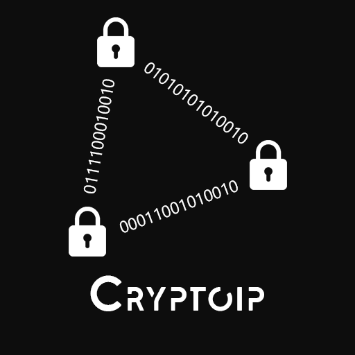

  

[Releases](https://github.com/DrayNeur/cryptoip/releases)

> VOIP Client / Server  
> Language: NodeJS, HTML, CSS, JS
 

Cryptoip is an Open source project, that can provide a client and server for securised communication, every data is encrypted with a strong cryptographic algorythm (aes-128-cbc), it can't be decrypted without the key.

### Libraries:
- express
- http
- socket.io
- electron
- crypto
- jquery
- node-notifier

### Features:
- Real time voip
- Encrypted packets with AES 128
- GUI with electron JS
- Server can handle mutliple clients
- Good voice quality
- Chat encrypted with AES 128
- Voice stream encrypted with AES 128
- Private messages
- Unique username
- Signature check
- Messages save on disk (not server)

### Why cryptoip ?
1. It provide good quality of communication.
2. It is impossible to track you even if the Owner of the server modify server code.
3. You are safe, all your packet (communication with server) is encrypted and can't be decrypted without the key.
4. Freedom, you can talk about anything on Cryptoip, the voip communication is encrypted
5. You cannot be impersonated with signature check and keyHash verification

### TODO:
- Addind panic button (erase all data of cryptoip)
- Fix mute button
- Proxy connection
- Voice detection
- Screen share
- Fix config file & data file
- Notification
- Fix signature popup position
